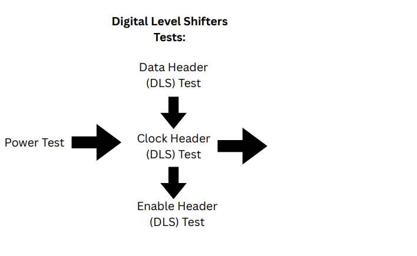

# MOSbius Testing 
### A LCD-based interface testing the functionality of the [MOSbius chip](https://mosbius.org/0_front_matter/intro.html) 

# Features 
- Menu and test selection interface using a LCD (ILI9341) display & Rotary Encoder
- Tests following the [testing process](https://mosbius.org/app_pcb_test/pcb_test.html) on the MOSbius website

# Uploading Files
## LCD Interface:
Note: This uses the ILI9341 LCD
  - Download all files in the lcd_interface folder to the Raspberry Pi Pico ( `mainLCD.py` `displayLCD.py` `hardwareLCD.py` `menuLCD.py` `runnerLCD.py` )
  - Download all files in the lcd_tests folder (e.g `powerTestV2.py` `digitalLvlTestV2.py` `manualENTestV2.py`)
    *Do NOT change the file names when downloading to the Raspberry Pi Pico*

# Hardware
### LCD Hardware (change as needed)
    Pins for Rotary Encoder:
      sw = Pin(13) 
      dt = Pin(14)
      clk = Pin(15)
    Pins for LCD Display
      COPI (coordinator out participant in) = Pin(19)
      CIPO (coordinator in participant out) = Pin(16)
      cs = Pin(26)
      dc = Pin(28)
      sck = Pin(18)
      rst = Pin(6)
    Pins for tests:
      ADC = Pin(27)
      signal = Pin(1)

# External Libraries *(Download and upload to the Raspberry Pi Pico)* 
## LCD:
  [rdagger micropython-ili9341](https://github.com/rdagger/micropython-ili9341)
## OLED: 
  [rdagger/micropython-ssd1306](https://github.com/rdagger/micropython-ssd1306)

# Current testing process: 

## Run each test following this order. See [lcd_tests](lcd_tests/README.md) for setting up each test. 
