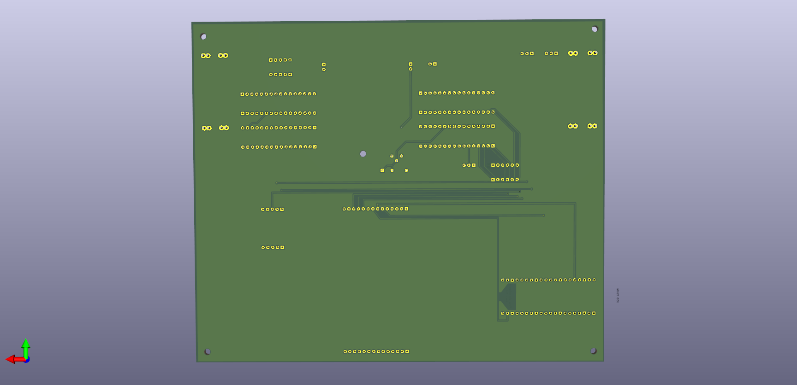

# MOSbius Testing Interface

A collection of MicroPython programs for running automated tests on the MOSbius PCB and on-chip modules (ring oscillator, current bias, etc.) via a Raspberry Pi Pico and an ILI9341 display. This interface tests the functionality of the [MOSBius](https://mosbius.org/0_front_matter/intro.html) PCB and chip.

## Table of Contents

- [Features](#features)
- [Schematics & Layout](#Schematics&Layout)
- [Requirements](#requirements)  
- [Installation](#installation)  
- [Usage](#usage)  
- [Testing Proceedure](#testing-proceedure)
- [License](#license)

---

## Features

- Automated **power supply + power supply protection** circuit test  
- Automated sequential **DT/CK/EN** header digital-level shifter tests  
- Automatted **Manual enable** voltage test  
- Full run of **PCB test**  
- Interactive **NMOS/PMOS current bias** confirmation  
- Interactive **ring oscillator** scope-based waveform check  

---
## Schematics & Layout

---

## Requirements
- Raspberry Pi Pico (or compatible RP2040 board)    
- ILI9341 SPI display  
- MicroPython firmware [Thonny](https://thonny.org/) (follow the website's directions for installation)
---

## Installation
1. Download and copy ALL FILES in `lcd_interface` folder onto your Pico's filesystem (DO NOT CHANGE FILE NAMES)
2. Download and copy the following files from external libraries onto your Pico's filesystem:
    - LCD → [rdagger micropython-ili9341](https://github.com/rdagger/micropython-ili9341) (`ili9341.py`)
    - MOSbius MicroPython Flow → [Jianxun MOSbius_MicroPython_Flow](https://github.com/Jianxun/MOSbius_MicroPython_Flow) (`MOSbius.py`) 

## MISC (TBE)
- ADC wiring:  
  - Orange → pin 27 (sensorO)  
  - Green  → pin 26 (sensorG)  
  - Yellow → pin 28 (sensorY)  
- Output pins:  
  - DT → pin 12  
  - CK → pin 11  
  - EN → pin 10  

## Testing Proceedure  
## Part 1: PCB Testing

### 1. Power Supply / Supply Protection
- Place a jumper between **V++** and **LDOO** headers on the MOSbius PCB.  
- Connect a wire between **pin 32 (GP27)** and the **+ header** near the MOSbius PCB socket.  
- Connect another wire between the **power pins of the Raspberry Pi** and the **LDOI header** on the MOSbius PCB.  
- Select the **“Power Test”** option on the menu.  
  - The **Red LED** should flash.

---

### 2. Digital Level Shifter Tests
- Connect wires:  
  - **Pin 28 → DT (LEFT header)**  
  - **Pin 26 → CK (LEFT header)**  
  - **Pin 32 → EN (LEFT header)**  
- Connect wires:  
  - **Pin 12 → DT (TOP header)**
  - **Pin 11 → CK (TOP header)**
  - **Pin 10 → EN (TOP header)**  
- Select **“Digital Level Shifter Test”** on the menu.  
  - **DT (blue), CK (yellow), and EN (green)** LEDs should flash.  
- *Note: individual level shifter tests are available as separate menu options.*

---

### 3. Manual Enable Test
- Place a wire or jumper on the **EM_PU headers** on the MOSbius PCB.  
- Connect a wire from **EN (LEFT header)** to **EM (LEFT header)**.  
- Select **“Manual Enable Test”** on the menu.  
  - The **Orange LED** should flash.

---

## Part 2: Chip Testing  
!!! Must be done **after PCB testing**.

### 1. Current Bias Potentiometers
- **NMOS Bias**: Bottom Left Potentiometer  
- **PMOS Bias**: Top Middle Potentiometer  
- Connect a **current meter** to the `+` and `-` terminals.  
- Turn the dial on the potentiometer until current ≈ **100 mA**.  
- *A menu test is provided, but is not required to perform this check.*  

---

### 2. Everything-Ring Oscillator Test
- Connect oscilloscope probes to **any two points** in the circuit.  
  - Example: **pins 16 & 55**.  
- Confirm the observed **waveform** looks correct.

